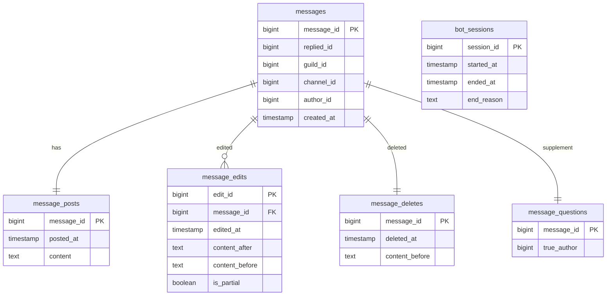

# DB設計

## DB構造

- messages.replied_idはnullable
- message_edits.edit_idは自動連番

## DB処理

- insertはバッチ処理
- insertはテーブルごとに異なるtaskとして実行される
- テーブル内での挿入順序は保証される
- update/deleteは使用せず、論理削除を行う
- bot_session tableはdaemon側が操作する
