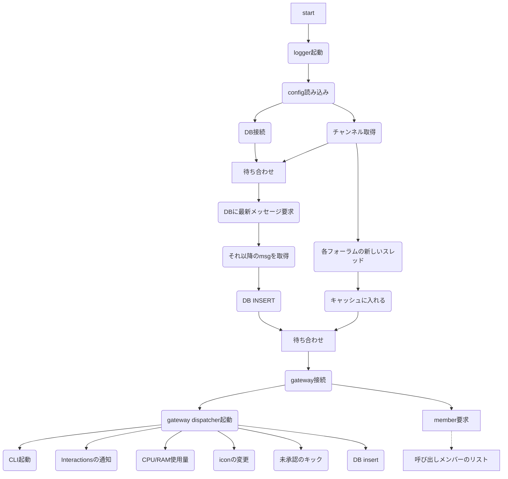
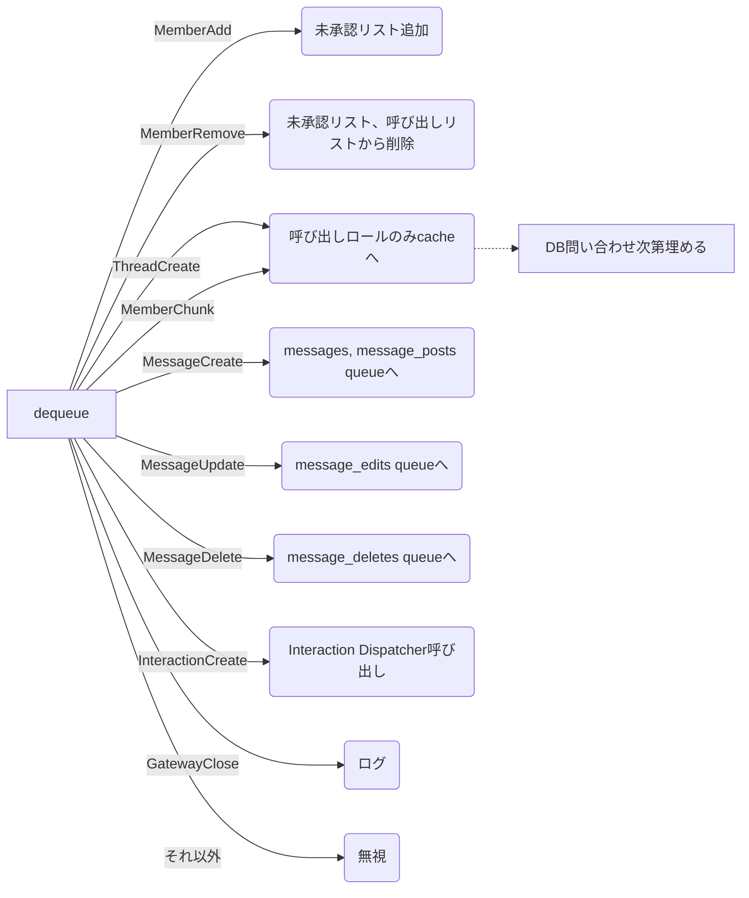
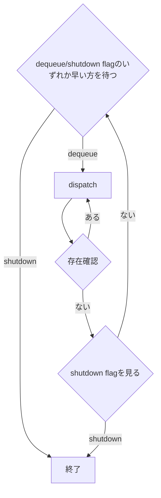
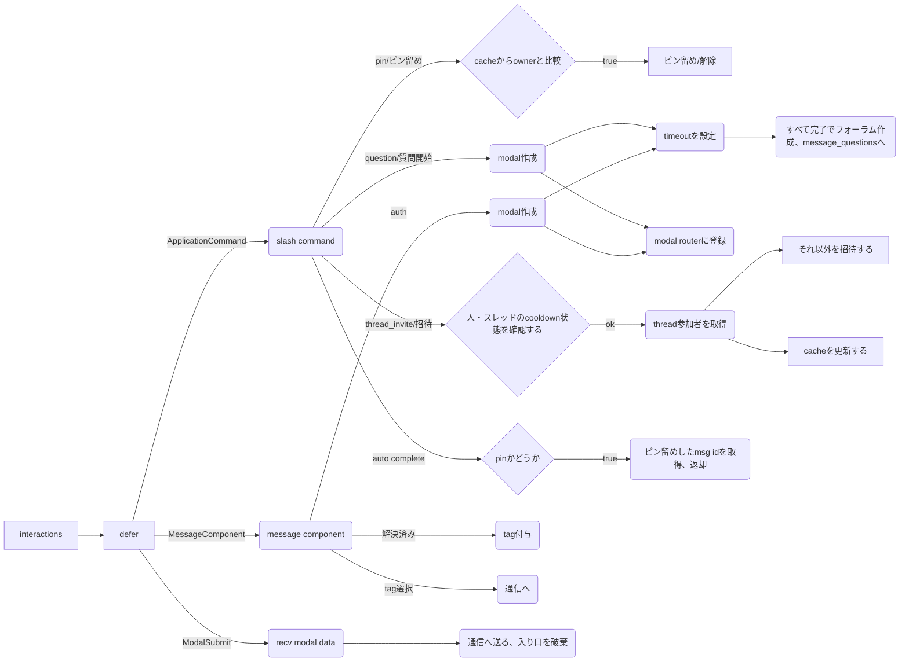
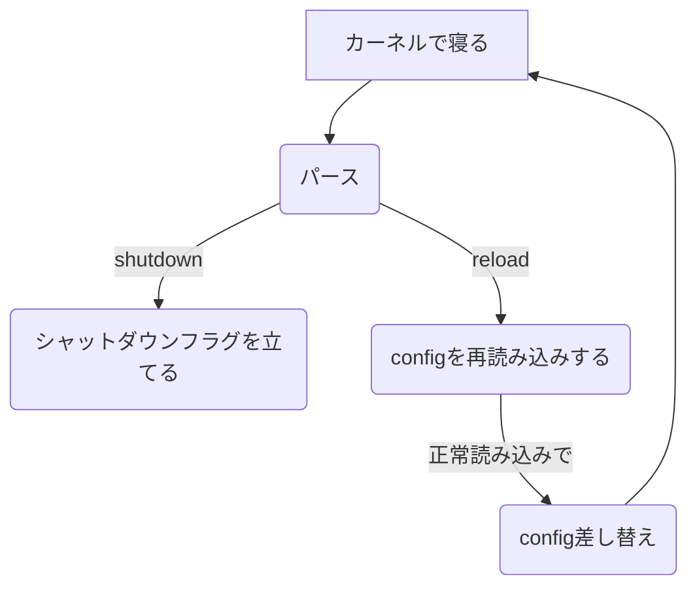
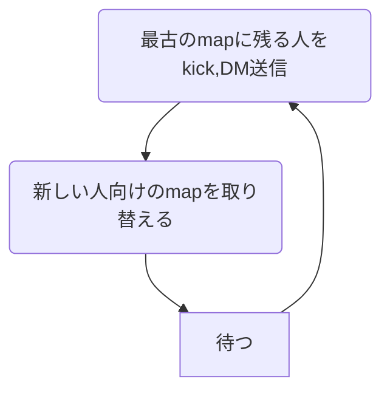
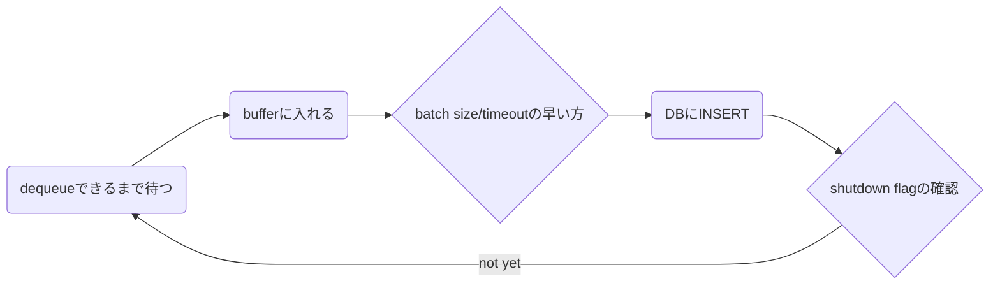

# フロー

## 起動時

```mermaid

flowchart TD
    start-->logger(logger起動)-->config(config読み込み)-->DB(DB接続)
    config-->get_channel(チャンネル取得)
    DB-->wait1[待ち合わせ]
    get_channel-->wait1
    wait1-->latest(DBに最新メッセージ要求)-->get_msg(それ以降のmsgを取得)-->insert(DB INSERT)-->wait2
    get_channel-->get_thread(各フォーラムの新しいスレッド)-->cache(キャッシュに入れる)-->wait2[待ち合わせ]

    wait2-->gateway(gateway接続)-->gateway_dispatcher(gateway dispatcher起動)
    gateway-->member要求-.->memberlist[呼び出しメンバーのリスト]

    gateway_dispatcher-->CLI(CLI起動)
    gateway_dispatcher-->interactions(Interactionsの通知)
    gateway_dispatcher-->sys(CPU/RAM使用量)
    gateway_dispatcher-->icon(iconの変更)
    gateway_dispatcher-->approval(未承認のキック)
    gateway_dispatcher-->queue(DB insert)
```

## Gateway Event Dispatcher

```mermaid
flowchart LR
    dequeue

    dequeue-->|MemberAdd|auth(未承認リスト追加)
    dequeue-->|MemberRemove|del(未承認リスト、呼び出しリストから削除)
    dequeue-->|ThreadCreate|cache(ownerが空の1次キャッシュ)-.->DB問い合わせ次第埋める
    dequeue-->|MessageCreate|posts(messages, message_posts queueへ)
    dequeue-->|MessageUpdate|edits(message_edits queueへ)
    dequeue-->|MessageDelete|deletes(message_deletes queueへ)
    dequeue-->|MemberChunk|cache(呼び出しロールのみcacheへ)
    dequeue-->|InteractionCreate|interactions(Interaction Dispatcher呼び出し)
    dequeue-->|GatewayClose|log(ログ)
    dequeue-->|それ以外|ignore(無視)
```

```mermaid
flowchart TD
wait{dequeue/shutdown flagのいずれか早い方を待つ}-->|shutdown|終了
wait-->|dequeue|dispatch-->exists{存在確認}-->|ある|dispatch
exists-->|ない|flag{shutdown flagを見る}-->|shutdown|終了
flag-->|ない|wait
```

## Interaction Dispatcher

```mermaid
flowchart LR
    interactions-->defer

    defer-->|ApplicationCommand|command(slash command)
    defer-->|MessageComponent|msg(message component)
    defer-->|ModalSubmit|modal(recv modal data)

    command-->|pin/ピン留め|cmp{cacheからownerと比較}-->|true|pin[ピン留め/解除]
    command-->|question/質問開始|create_modal(modal作成)-->timeout(timeoutを設定)-->completed(すべて完了でフォーラム作成、message_questionsへ)
    create_modal-->routing(modal routerに登録)
    command-->|thread_invite/招待|cooldown_check{人・スレッドのcooldown状態を確認する}-->|ok|get_thread(thread参加者を取得)-->それ以外を招待する
    get_thread-->cacheを更新する
    command-->|auto complete|is_pin{pinかどうか}-->|true|get_pinned(ピン留めしたmsg idを取得、返却)

    msg-->|auth|start_auth(modal作成)-->timeout
    start_auth-->routing
    msg-->|解決済み|solved(tag付与)
    msg-->|tag選択|transfer(通信へ)

    modal-->send_once(通信へ送る、入り口を破棄)
```

## CLI

```mermaid
flowchart TD
wait[カーネルで寝る]-->parse(パース)-->|shutdown|shutdown(シャットダウンフラグを立てる)
parse-->|reload|reload(configを再読み込みする)-->|正常読み込みで|exg(config差し替え)-->wait
```

## 未承認キック

```mermaid
flowchart TD
task(最古のmapに残る人をkick,DM送信)-->exg(新しい人向けのmapを取り替える)-->wait[待つ]-->task
```

shutdown時は外部から強制終了

## DB

```mermaid
flowchart LR
dequeue(dequeueできるまで待つ)-->buf(bufferに入れる)-->select{batch size/timeoutの早い方}-->insert(DBにINSERT)-->flag{shutdown flagの確認}-->|not yet|dequeue
```
